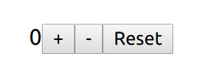

# React-workshop för DataTjej med Cygni

React introduktionsworkshop med hooks och styled-components - https://datatjej.se/

This project was bootstrapped with [Create React App](https://github.com/facebook/create-react-app).

## Förberedelser / För att komma igång

[Kolla in förberedelsesidan](https://github.com/cygni/cygni-datatjej-react/wiki/Hem)

## Del 1 - React basics, komponenter, props och state

### Nybörjare

1. Skapa en räknare som kan räkna upp med knapptryck. I `App.css` finns några css-klasser som ni kan använda för att styla elementen. Använd `.container` för rootelementet, `.counter` för räknaren och `.button` samt `.increase-button` för knappen.
2. Lägg till en till knapp som låter användaren räkna ned. Använd css-klassen `.decrease-button` för styling.
3. Lägg till en tredje knapp som låter användaren nollställa räknaren. Använd css-klassen `.reset-button` för styling.

Exempel på resultat: 

### Dabbler

1. Skapa ett fält som visar hur lång tid det är kvar till en viss (förbestämd) tidpunkt, t.ex. nedräkning till julafton
2. Låt användaren ange datum som det räknas ned till
3. Bryt ut fälten + input från steg 1 och 2 ovan till en egen komponent så flera nedräknare kan visas samtidigt

Exempel på resultat:

### Pro

- Skapa en räknare likt uppgift 1 på Dabblernivå men formatera tiden till ett human-friendly format med exempelvis biblioteket [`moment`](https://momentjs.com/)
- Skapa en räknare som räknar upp/ned likt uppgift 1-3 på Nybörjarnivå men använd `useReducer` från React för stateuppdatering

Exempel på resultat:

## Del 2 - Styled components

### Nybörjare

1. Gör om elementet med css-klassen `.container` till en styled div
2. Gör om elementet med css-klassen `.counter` till en styled component som tar in en prop som bestämmer färgen på texten
3. Gör om alla knappar med css-klass `.button` till styled components. Ni kan behålla övriga css-klasser.
4. Gör om knappen med css-klassen `.reset-button` till en egen styled component som baseras på er button component

### Dabbler

1. Ge nu er button component en defaultfärg och gör det möjligt att skriva över den färgen med en prop. Färglägg increase button och decrease button, men låt reset button använda defaultfärgen.
2. Skapa en ny knappkomponent som förutom text även tar in en ikon som prop. Basera sedan er styliserade knappkomponent på denna istället. Tänk på att en egen komponent som ska gå att styla på detta vis måste ta in `className` som en prop.

### Pro

- Skapa ett eget tema med bakgrundsfärg och textfärg
- Använd ditt tema så att hela din App får möjligheten att utnyttja temat
- Skapa styled komponents för som tar in tema och använder färgerna ifrån temat samt har default värden.

## Tillgängliga skripts

I projektmappen så kan du i en terminal köra köra:

### `yarn start` eller `npm start`

Kör appen i development mode. 
Öppna [http://localhost:1337](http://localhost:1337) för att se den i webbläsaren.

Sidan laddar om ifall du gör ändringar i koden. 
Ev lintfel kommer presenteras i konsollen (console)

### `yarn test` eller `npm test`

Startar testköraren i interkativt läge (interactive watch mode) 
För mer information om att köra tester på engelska: [running tests](https://facebook.github.io/create-react-app/docs/running-tests)

### `yarn build` eller `npm run build`

Bygger appen för produktion till `build`-mappen. 
Bundlar med React i produktionsläge och optimerar bygget för bästa prestanda.

Bygget blir miniferat och filnamnen inkluderar hashar (används för cache-invalidation mm)

För mer information om deployment på engelska: [deployment](https://facebook.github.io/create-react-app/docs/deployment)

## Nedan är Create-React-app info på Engelska om mer advancerade bitar, kan ignoreras nu

### `npm run eject`

**Note: this is a one-way operation. Once you `eject`, you can’t go back!**

If you aren’t satisfied with the build tool and configuration choices, you can `eject` at any time. This command will remove the single build dependency from your project.

Instead, it will copy all the configuration files and the transitive dependencies (Webpack, Babel, ESLint, etc) right into your project so you have full control over them. All of the commands except `eject` will still work, but they will point to the copied scripts so you can tweak them. At this point you’re on your own.

You don’t have to ever use `eject`. The curated feature set is suitable for small and middle deployments, and you shouldn’t feel obligated to use this feature. However we understand that this tool wouldn’t be useful if you couldn’t customize it when you are ready for it.

## Learn More

You can learn more in the [Create React App documentation](https://facebook.github.io/create-react-app/docs/getting-started).

To learn React, check out the [React documentation](https://reactjs.org/).

### Code Splitting

This section has moved here: https://facebook.github.io/create-react-app/docs/code-splitting

### Analyzing the Bundle Size

This section has moved here: https://facebook.github.io/create-react-app/docs/analyzing-the-bundle-size

### Making a Progressive Web App

This section has moved here: https://facebook.github.io/create-react-app/docs/making-a-progressive-web-app

### Advanced Configuration

This section has moved here: https://facebook.github.io/create-react-app/docs/advanced-configuration

### Deployment

This section has moved here: https://facebook.github.io/create-react-app/docs/deployment

### `npm run build` fails to minify

This section has moved here: https://facebook.github.io/create-react-app/docs/troubleshooting#npm-run-build-fails-to-minify
