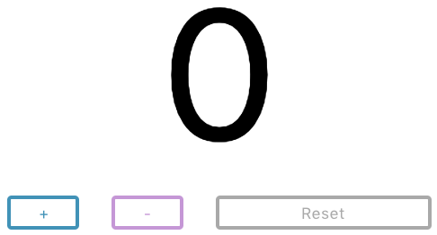

# React-workshop med Cygni

## Förberedelser / För att komma igång

1. Klona detta repo eller ladda ner och unzippa det.
2. Installera [Visual Studio Code](https://code.visualstudio.com/) (eller annan
   lämplig IDE)
3. [Installera node och
   npm](https://github.com/cygni/cygni-external-react-workshop/wiki/Installera-NPM)
4. Stå i projektmappen och skriv `npm install` i terminalen
5. Skriv `npm start` i terminalen för att köra projektet

## Workshop 1 - React 101

Grunderna i React: komponenter, props och state.

Följande övningar ska göras i mappen `react-exercises`.

**Nybörjare (Counter) Del 1**

_Följande övningar ska göras i filen 'CounterExercise.js'._

1. Skapa ett state som håller countern värde, den ska börja på 0.
2. Lägg till en knapp som låter använderen räkna upp vid knapptryck.
3. Lägg till en till knapp som låter användaren räkna ned.
4. Lägg till en tredje knapp som låter användaren nollställa räknaren.
5. Styling, i App.css finns där färdiga classer att använda, dessa är:
   `.container` för rootelementet. Applicera följande klasser på rätt element:
   `.counter, .button, .increase-button, decrease-button, .reset-button`

Exempel på resultat: 

&nbsp;

**Nybörjare (Counter) Del 2**

_Följande övningar ska göras i filen 'ReducerCounterExercise.js'._

Bygg samma counter som innan, fast använd nu **reducer hook** istället. Skapa en reducer som har två actions för **increment** och **decrement** och låt knapparna dispatcha motsvarande action.

&nbsp;

**Dabbler**

_Följande övningar ska göras i filen 'DateCountdownExercise.js'._

1. Skapa en input där användaren kan ange ett datum att räkna ner till.
2. Skapa ett element som printar ut hur lång tid det är kvar till angivet datum.

Exempel på resultat: 

**Pro del 1**

_Följande övning ska göras i filen 'DateCountdownExercise.js'_

1. Uppdatera tiden som är kvar till angivet datum varje sekund med hjälp av
   useEffect().

**Pro del 2**

_Följande övning ska göras i filen 'HumanfriendlyDateCountdownExercise.js'._

1. Skapa en nedräknare likt uppgiften på Dabblernivå men formatera tiden till
   ett human-friendly format med exempelvis biblioteket
   [`date-fns`](https://date-fns.org/). Paketet är redan installerat, men kräver att du importerar de funktioner som du behöver i filen.

Exempel på resultat: 

## Lär dig mer

Kolla in [Reacts dokumentation](https://reactjs.org/).

Små "kata"-övningar för att lära sig React:
[React Katas](https://www.codewars.com/collections/react-katas).
