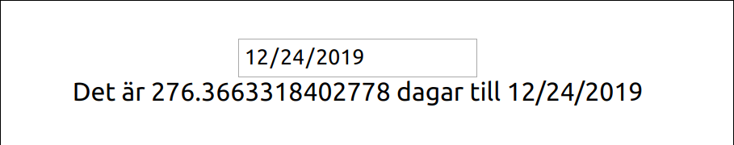
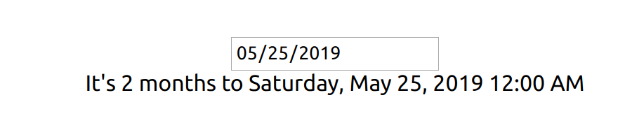

# React-workshop med Cygni

## Förberedelser / För att komma igång

1. Börja med att klona detta repot eller ladda ner och sen unzippa det.
2. Installera [Visual Studio Code](https://code.visualstudio.com/) (eller annan
   lämplig IDE)
   - Installera plugin för styled component: Öppna Visual Studio Code, tryck
     `CTRL + P` och skriv in `ext install vscode-styled-components`
3. Installera
   [NPM](https://github.com/cygni/cygni-external-react-workshop/wiki/Installera-NPM)
4. Stå i projektmappen och skriv `npm install` i terminalen
5. Skriv `npm start` i terminalen för att köra projektet

&nbsp;

## Workshop 1

_React basics, komponenter, props och state_

**Nybörjare (Counter) Del 1**

_Följande övningar ska göras i filen 'CounterExercise.js'._

1. Skapa ett state som håller countern värde, den ska börja på 0.
2. Lägg till en knapp som låter använderen räkna upp vid knapptryck.
3. Lägg till en till knapp som låter användaren räkna ned.
4. Lägg till en tredje knapp som låter användaren nollställa räknaren.
5. Styling, i App.css finns där färdiga classer att använda, dessa är:
   `.container` för rootelementet. Applicera följande klasser på rätt element:
   `.counter, .button, .increase-button, decrease-button, .reset-button`

Exempel på resultat: 

&nbsp;

**Nybörjare (Counter) Del 2**

_Följande övningar ska göras i filen 'ReducerCounterExercise.js'._

Bygg samma counter som innan, fast använd nu **reducer hook** istället. Skapa en reducer som har två actions för **increment** och **decrement** och låt knapparna dispatcha motsvarande action.

&nbsp;

**Dabbler**

_Följande övningar ska göras i filen 'DateCountdownExercise.js'._

1. Skapa en input där användaren kan ange ett datum att räkna ner till.
2. Skapa ett element som printar ut hur lång tid det är kvar till angivet datum.

Exempel på resultat: 

**Pro del 1**

_Följande övning ska göras i filen 'DateCountdownExercise.js'_

1. Uppdatera tiden som är kvar till angivet datum varje sekund med hjälp av
   useEffect().

**Pro del 2**

_Följande övning ska göras i filen 'HumanfriendlyDateCountdownExercise.js'._

1. Skapa en nedräknare likt uppgiften på Dabblernivå men formatera tiden till
   ett human-friendly format med exempelvis biblioteket
   [`date-fns`](https://date-fns.org/). Paketet är redan installerat, men kräver att du importerar de funktioner som du behöver i filen.

Exempel på resultat: 

&nbsp;

## Workshop 2 - Styled components

**Nybörjare**

_Skapa de stylade komponenterna i filen 'style.js'._

1. Gör om elementet med css-klassen `.container` till en styled section
2. Gör om elementet med css-klassen `.counter` till en styled component som tar
   in en prop som bestämmer färgen på texten
3. Gör om alla knappar med css-klass `.button` till styled components. Ni kan
   behålla övriga css-klasser.
4. Gör om knappen med css-klassen `.reset-button` till en egen styled component
   som baseras på er button component

**Dabbler**

1. Ge nu er button component en defaultfärg och gör det möjligt att skriva över
   den färgen med en prop. Färglägg increase button och decrease button, men låt
   reset button använda defaultfärgen.
2. Skapa en ny knappkomponent som förutom text även tar in en ikon som prop.
   Basera sedan er styliserade knappkomponent på denna istället. Tänk på att en
   egen komponent som ska gå att styla på detta vis måste ta in `className` som
   en prop.

&nbsp;

## Learn More

You can learn more in the
[Create React App documentation](https://facebook.github.io/create-react-app/docs/getting-started).

To learn React, check out the [React documentation](https://reactjs.org/).

Short "kata" exercises for learning React:
[React Katas](https://www.codewars.com/collections/react-katas).
